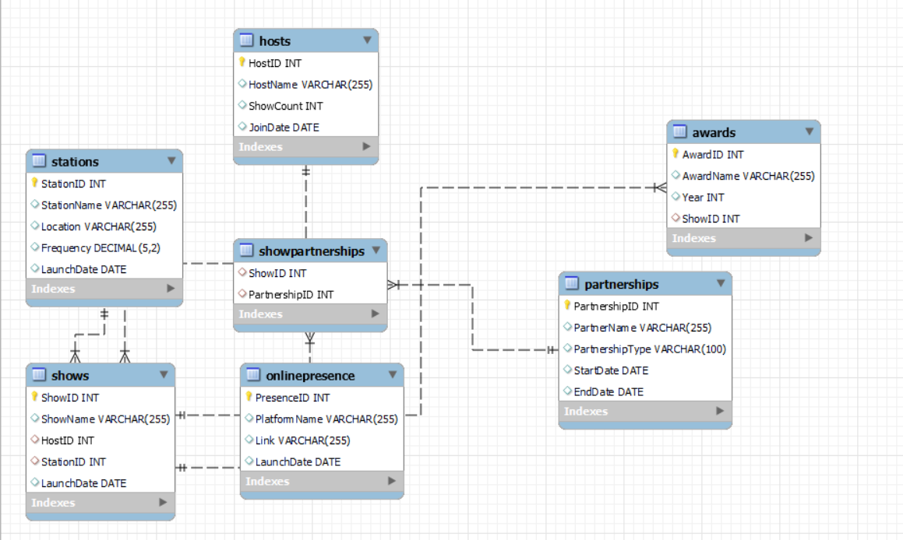

# Challenge 1 - 92.7 BIG FM radio Network

## Tables 

1.Stations

2.Hosts

3.Shows

4.Partnerships

5.ShowPartnerships

6.Awards

7.OnlinePresence  

## Entity Relationship Diagram

## Questions

1) Retrieve all stations in the "East" region?
2) List all shows hosted by "Vrajesh Hirjee"?
3) Count the number of awards each show has won?
4) Find shows that have partnerships with "Spotify"?
5) Retrieve hosts who joined before 2010?
6) List the shows and their launch dates in descending order of launch date?
7) Find the total count of shows for each host?
8) Show the online presence platforms with their links?
9) Retrieve the stations in the "South" region launched after 2010?
10) Rank hosts based on the number of shows they have hosted?
    
Access solutions [Here]()
